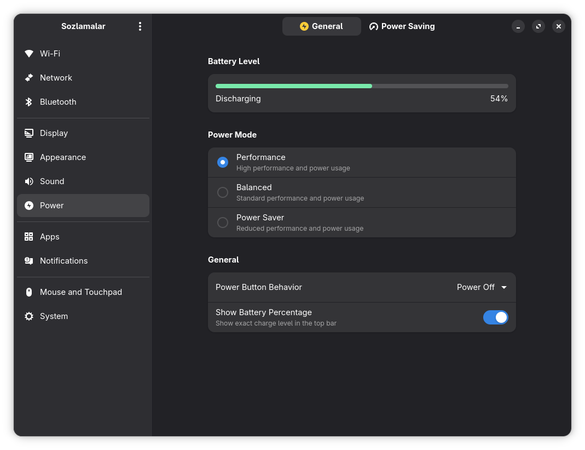

<p align="center">
    <h3 align="center">GNOME Settings Application written on Rust/GTK.</h3>
</p>

<p align="center">
    
</p>

<p align="center">
     <a href="https://git.oss.uzinfocom.uz/xinux/settings/actions?workflow=test.yml"></a>
     
</p>

## About

Rewritten version of GNOME Control Center for Xinux OS.

## Development

Add nix-data to your flake.nix input and configuration.nix. ~/.config/nix-data/ your config locations via json here
flake.nix input

```nix
nix-data = {
  url = "github:xinux-org/nix-data";
  inputs.nixpkgs.follows = "nixpkgs";
};
```

Change these to yours in configuration.nix.

```nix
programs.nix-data = {
  enable = true;
  systemconfig = "/home/bahrom/workplace/bahrom04/nix-config/systems/x86_64-linux/dell/default.nix";
  flake = "/home/bahrom/workplace/bahrom04/nix-config/flake.nix";
  flakearg = "dell"; # your hostname
};
```

## Build & run

This application has Linux-only dependencies.

```bash
# download dependencies
nix develop

just install

cd ..
./settings/builddir/install/bin/settings

# or with nix when ready for release
nix build . --show-trace
./settings/result/bin/settings

# app run
just run

# Optional. Generate translation words from /po/POTFILES.in if needed.
cd ./po
xgettext --directory=.. --files-from=POTFILES.in --from-code=UTF-8 -kgettext -o translations.pot
```
